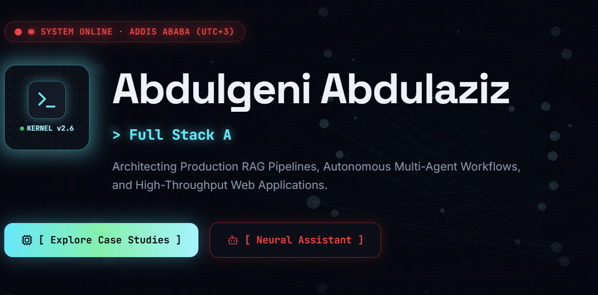

<div align="center">



<br/><br/>

# ⚡ ABDULGENI ABDULAZIZ

### `// Full Stack AI Engineer`

<em>Architecting intelligent systems where full-stack engineering meets applied AI</em>

<br/>

[](https://your-domain.vercel.app)
[](https://www.linkedin.com/in/abdulgeni-abdulaziz-7bb360401)
[](https://github.com/Abdulgeni)
[](mailto:abdulgeniabdulaziz@gmail.com)

<br/>


</div>

<br/>

---

<div align="center">

### `📍 Addis Ababa, Ethiopia` &nbsp;·&nbsp; `🎓 BSc CS & Engineering, ASTU` &nbsp;·&nbsp; `🗣️ 5 Languages`

</div>

---

<br/>

## 📖 Table of Contents

<div align="center">

[Overview](#-overview) • [Features](#-features) • [Tech Stack](#-tech-stack) • [Getting Started](#-getting-started) • [Architecture](#-project-structure) • [Roadmap](#-roadmap) • [Connect](#-connect)

</div>

<br/>

## ✦ Overview

> This isn't a template. This is a fully engineered, production-grade portfolio built to *prove* full-stack and applied-AI capability — not just describe it.

Every section of this site is a real, working system: a live Gemini-powered AI assistant that actually reasons about my background, GitHub statistics pulled live from the API (not screenshots), and an interactive architecture explorer showing genuine system designs I've shipped. Built on Next.js's App Router with strict TypeScript, a custom WebGL particle background, and meticulous motion design throughout.

<br/>

## ✦ Features

<table>
<tr>
<td width="50%" valign="top">

### 🤖 Live AI Assistant
Embedded Gemini-powered chat that reasons about my real background, skills, and project history — not a scripted FAQ bot.

### 📊 Dynamic GitHub Stats
Repository count, stars, forks, followers, and language breakdown — pulled live from the GitHub API on every visit.

### 🏗️ Architecture Explorer
An interactive bento grid breaking down real system designs: RAG pipelines, automation workflows, secured API proxy patterns.

### 🌐 Multi-Language Support
Complete UI localization with a polished, animated language switcher.

</td>
<td width="50%" valign="top">

### 🌗 Adaptive Theming
Buttery-smooth light/dark theme transitions, with a `T` keyboard shortcut for power users.

### ✨ WebGL Neural Background
A custom Three.js particle field, hand-tuned for performance without sacrificing visual density.

### 📬 Real Contact Delivery
A working contact form with genuine email delivery via Resend — messages land in my actual inbox.

### 📱 Engineered for Mobile
Purpose-built scrollable navigation drawer and touch-optimized interactions across every breakpoint.

</td>
</tr>
</table>

<br/>

## ✦ Tech Stack

<div align="center">

<table>
<tr><td align="center" width="96"><br/><sub><b>Next.js</b></sub></td>
<td align="center" width="96"><br/><sub><b>React</b></sub></td>
<td align="center" width="96"><br/><sub><b>TypeScript</b></sub></td>
<td align="center" width="96"><br/><sub><b>Tailwind</b></sub></td>
<td align="center" width="96"><br/><sub><b>Three.js</b></sub></td>
<td align="center" width="96"><br/><sub><b>Node.js</b></sub></td>
</tr>
</table>

</div>

| Layer | Technologies |
|---|---|
| **Frontend** | Next.js 16 (App Router) · React 19 · TypeScript · Tailwind CSS 4 · Framer Motion |
| **3D / Graphics** | Three.js · @react-three/fiber · @react-three/drei |
| **AI** | Google Gemini API (`@google/genai`) |
| **Email** | Resend |
| **Icons** | Lucide React |
| **Deployment** | Vercel |

<br/>

## ✦ Getting Started

<table>
<tr><td>

**Prerequisites:** Node.js `20.19+` · A [Gemini API key](https://aistudio.google.com/apikey) · A [Resend API key](https://resend.com) *(optional)*

```bash
# 1. Clone the repository
git clone https://github.com/Abdulgeni/my-portfolio.git
cd my-portfolio

# 2. Install dependencies
npm install

# 3. Configure environment variables
cp .env.example .env.local
# → fill in GEMINI_API_KEY and RESEND_API_KEY

# 4. Launch the dev server
npm run dev
```

Then open **[localhost:3000](http://localhost:3000)** 🚀

</td></tr>
</table>

**Production build:**
```bash
npm run build && npm run start
```

<br/>

## ✦ Project Structure
my-portfolio/
├── app/
│ ├── api/
│ │ ├── chat/ ⟶ Gemini AI assistant endpoint
│ │ ├── contact/ ⟶ Resend email delivery
│ │ └── github/ ⟶ Live GitHub stats fetcher
│ └── page.tsx ⟶ Root composition
├── components/ ⟶ Hero, Navbar, sections, widgets
├── lib/ ⟶ Data, contexts, animation presets
├── hooks/ ⟶ Custom React hooks
└── public/ ⟶ Static assets


<br/>

## ✦ Roadmap

- [ ] Live GitHub contribution graph via GraphQL
- [ ] Dynamic project cards sourced from pinned repositories
- [ ] Engineering blog / dev-log section
- [ ] Auto-generated per-section OG images

<br/>

## ✦ Connect

<div align="center">

<br/>

**Let's build something intelligent together.**

[](mailto:abdulgeniabdulaziz@gmail.com)
[](https://www.linkedin.com/in/abdulgeni-abdulaziz-7bb360401)
[](https://github.com/Abdulgeni)

<br/><br/>

<sub>Built with obsessive attention to detail by <b>Abdulgeni Abdulaziz</b></sub>


</div>
